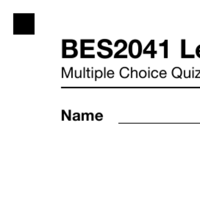
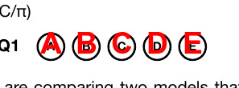
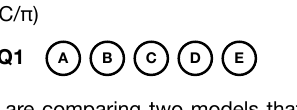
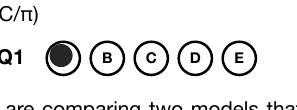
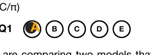
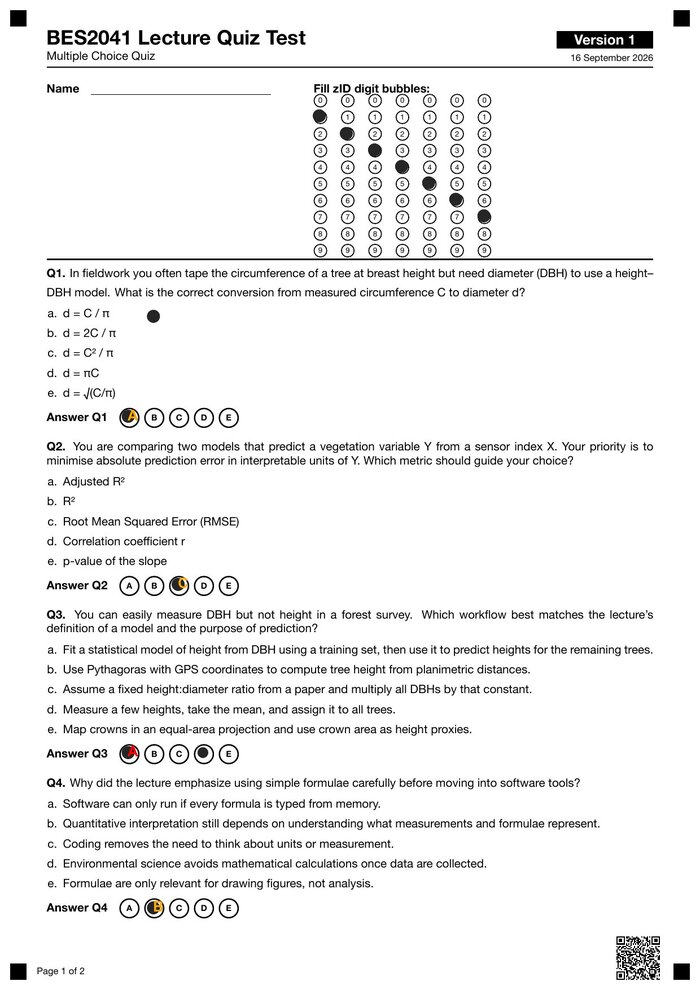

# bubblequiz

[](https://github.com/wcornwell/bubblequiz/actions/workflows/R-CMD-check.yaml)
[](LICENSE.md)


You need to give a low-stakes multiple-choice quiz, and you can no longer trust the obvious way to give it.

Put it on the learning platform and a student has an LLM open in the next tab, or
a browser extension that answers the question before they've finished reading it.
Locking down the browser, the room, and the network is an arms race you can't win
one quiz at a time. The old answer to this problem — a printed sheet, a pencil,
and a bubble to fill in — never had that problem, because there was nothing to
paste the question into. Most universities, though, dismantled the scantron
infrastructure that used to make paper multiple choice practical at scale: no
scanner, no proprietary form, no one left who runs the machine.

`bubblequiz` is a modern, personal-scale replacement for that machine. It
designs a quiz, typesets it to LaTeX with randomized question/option order and
QR-coded anchors, and — because it knows the exact geometry of the printed page
and where every bubble sits relative to those anchors — reads the scanned
answer sheets back with ordinary computer vision, entirely on your own machine.
A large language model could technically grade a bubble sheet too, but sending
a classroom's identifying ID numbers and answers to a cloud API is both a
privacy exposure you don't need and considerable overkill for a task that comes
down to "is this box dark or light." Where a mark is genuinely ambiguous —
a half-filled bubble, a smudge, a stray mark — bubblequiz doesn't guess; it
flags the row for a human to look at instead.

In short: write the questions once, print shuffled QR-coded forms, scan the
completed sheets, mark them with local computer vision, and upload the grades
to Moodle.

```text
exam.yml + questions.md
        │  generate_versions()   make_quiz_forms()   combine_quiz_forms()
        ▼
output/quizforms_all_versions.pdf  ──►  print duplex, students fill in bubbles
                                                    │
                                                    ▼
week2_scans/*.pdf  ──►  mark_quiz()  ──►  review.csv  ──►  mark_quiz()  ──►  moodle_import.csv
```

- **One config.** The quiz shape (sections, marks, versions, zID format) lives
  in `exam.yml`; questions live in a plain Markdown file.
- **Shuffled versions.** Question and option order is randomised per version.
  Every page carries a QR code with its version and page number, so marking
  uses the right answer key automatically.
- **Local, deterministic marking.** Bubbles and zIDs are read from the scan
  with image processing, and the same scan always gives the same result.
- **It never guesses.** Anything not read cleanly (corrections, faint marks,
  skewed pages, unknown zIDs, feeder errors) goes to a review file for a
  person to decide. Those decisions are kept as a permanent record.
- **Offline.** Nothing is sent to any outside service.

The package is the reusable engine. Each course keeps its own `exam.yml`,
`questions.md`, scans and outputs in a separate course folder.

## Contents

- [Installation](#installation)
- [Quick start](#quick-start)
- [The course folder](#the-course-folder)
- [Printing and scanning](#printing-and-scanning)
- [Marking](#marking)
- [Reviewing flagged sheets](#reviewing-flagged-sheets)
- [How it works](#how-it-works)
- [Command line](#command-line)
- [Worked example](#worked-example)

## Installation

```r
# install.packages("remotes")
remotes::install_github("wcornwell/bubblequiz")
```

System tools (macOS with Homebrew shown):

| Tool | Needed for | Install |
|---|---|---|
| XeLaTeX + `qrcode` package, pandoc | rendering forms | MacTeX or TeX Live; `brew install pandoc` |
| poppler (`pdftoppm`) | rendering scans to images | `brew install poppler` |
| zbar (`zbarimg`) | reading QR codes | `brew install zbar` |
| ImageMagick | image processing | `brew install imagemagick` |

On Debian or Ubuntu:
`sudo apt install poppler-utils zbar-tools texlive-xetex texlive-latex-extra`.

## Quick start

```r
library(bubblequiz)

init_course("my-quiz")       # starter exam.yml, questions.md and Makefile
setwd("my-quiz")
# ... edit exam.yml and questions.md ...

check_config("exam.yml")     # validate the config and show the layout it implies
generate_versions("exam.yml", "questions.md", "output")
make_quiz_forms("exam.yml", "output")
combine_quiz_forms("exam.yml", "output")
```

Print `output/quizforms_all_versions.pdf` double-sided and run the quiz. Then
put the scanned PDFs in a folder and mark:

```r
mark_quiz("week2_scans", config = "exam.yml", forms = "output",
          grade_item = "Week 2 quiz", roster = "gradebook_export.csv")
```

Work through `week2_scans/review.csv`, run `mark_quiz()` again, and upload
`week2_scans/moodle_import.csv`.

## The course folder

```text
my-quiz/
  exam.yml          quiz structure
  questions.md      question bank with answers
  output/           generated versions, answer key and print PDFs
  week2_scans/      scanned PDFs, and everything marking writes
```

### `exam.yml`

```yaml
course: BES2041
title: "BES2041 Lecture Quiz"
date: "16 September 2026"
subtitle: "Multiple Choice Quiz"
duration: "10 min"
total_marks: 6
versions: 4
options: [A, B, C, D, E]

id:
  label: zID
  prefix: z
  digits: 7

layout:
  columns: 1        # inline quiz forms require a single column

sections:
  - id: A
    title: "Quantitative skills and coding"
    questions: [1, 2, 3, 4, 5, 6]
    marks_each: 1
```

### `questions.md`

Write the file by hand. Each question has its options and an HTML comment
giving the answer:

```markdown
**Question 1 [1 mark]:** What is the best interpretation of RMSE?

a. A measure of absolute prediction error in response units
b. A test of whether the intercept is zero
c. A measure that always increases with sample size
d. A correlation coefficient
e. A p-value

<!-- Answer A -- RMSE is expressed in the response variable's units. -->
```

### Figures and math

A question can show one figure, on its own line between the stem and the options:

```markdown
{width=0.7}
```

The path is relative to `questions.md`; `width` is a fraction of the text width
(default 0.8); the caption is printed under the figure. Figures are capped in
height by `layout.figure_max_height` in `exam.yml` (default `7cm`). Figures take
up space on the answer sheet, which is capped at two pages, so keep them small
when a quiz is already long.

`$...$` in stems, options and captions is typeset as math (`$R^2$`, `$p < 0.05$`).
Dollar signs that do not pair up as math (`costs $5 and $10`) stay literal, and
`\$` is always a literal dollar sign. Everything else is escaped as before.

### How many questions fit

With moderately wordy questions:

```text
6-8 questions    comfortable on one double-sided sheet
10 questions     practical upper limit for one double-sided sheet
11+ questions    spills onto a second sheet
```

Multi-page forms are marked correctly (see
[How it works](#how-it-works)), but a single sheet per student is easier to
handle and scan.

## Printing and scanning

Print `output/quizforms_all_versions.pdf` **duplex**. Versions are in order
and each one stays together, so the stack can go straight to the printer.
Students should use black or dark blue pen and fill bubbles completely.

Scanner settings:

```text
Grayscale (colour works, but files are ~3x larger and it reads no better)
200-300 dpi
PDF output
No auto-crop, auto-rotate, text enhancement or high-contrast cleanup
```

A 150-student stack can go through as one PDF or several. Sheet feeders
sometimes swallow pages, double-feed or flip a sheet. Every page's QR code
records its version, page number and sheet length, so `mark_quiz()` catches
these errors before marking anything.

## Marking

Put every scan PDF for one quiz in a single folder and run:

```r
mark_quiz("week2_scans", config = "exam.yml", forms = "output",
          grade_item = "Week 2 quiz")
```

This renders, sequence-checks, marks and scores every scan in the folder, and
writes:

```text
week2_scans/moodle_import.csv   Username + grade: clean and resolved sheets only
week2_scans/review.csv          every sheet that needs a person, and your decisions
```

Add `roster = "gradebook_export.csv"` (any CSV with a `Username` column, such
as a Moodle gradebook export) to hold back any sheet whose zID is not
enrolled. For each such sheet, the review reason lists enrolled zIDs that are
one digit away or have two digits swapped, so you can match a misbubbled zID
to the name written on the sheet.

Running `mark_quiz()` again is quick: scans already marked are skipped unless
their PDF has changed (or `remark = TRUE`). Upload `moodle_import.csv` once
`review.csv` has nothing left open. In Moodle, go to **Grades > Import > CSV
file** and map `Username` to "username" and the grade column to your grade
item.

### Spot-checking the marker

```r
spot_check("week2_scans", config = "exam.yml", forms = "output")
```

This writes `week2_scans/spot_check.html`, with an overlay image for a sample
of sheets: pages rejected as crooked, pages that only just passed, zIDs not on
the roster, and a random sample of untouched sheets. Each overlay shows the
expected position of each printed anchor and each bubble, and which bubbles
were read as filled. You can see at a glance that the marker is reading what
students wrote.

### Running the steps one at a time

`mark_quiz()` runs these steps for each scan PDF:

```r
preprocess_scans("scans.pdf", "exam.yml", force = TRUE)   # PDF -> page images
check_scan_sequence("scans")                              # group pages into sheets
mark_scans_cv("scans", config = "exam.yml", forms = "output")
aggregate_sheets("scans", config = "exam.yml")            # join pages per student
score_results("scans", key = "output/answer_key.csv", config = "exam.yml",
              review = "review.csv")
export_moodle("scans", output = "moodle_import.csv", review = "review.csv",
              grade_item = "Week 2 quiz", config = "exam.yml")
```

Files written in each scan folder:

```text
scan_sequence.csv   one row per page: version, page number, sheet
progress.csv        one row per page, as read by the marker
registration.csv    how well each page lined up with its blank form
marked-cv/          each page with the recorded answers drawn on
sheets.csv          one row per student, pages joined
results.csv         scores, with needs_review, notes and answers as read
```

## Reviewing flagged sheets

A sheet is flagged when anything on it was not read cleanly. `review.csv`
gives the reason:

```text
two marks          two bubbles filled in one row: usually a correction;
                   the crossed-out one is often darker, so neither is chosen
faint mark         a mark too light to accept
blank              an unanswered question, or an empty zID column
ambiguous          two bubbles too close to call
QR unreadable      version taken from the other side of the sheet
back side first    a sheet put through the scanner the wrong way round
out of register    the sheet went through skewed or shifted, so its printed
                   text is not where it should be. Nothing on that page is
                   read (answers show *, the zID ?). Rescan it straight.
zID not on roster  the zID is not in the class list (when `roster` is given);
                   the reason names the closest enrolled zIDs
```

Each row shows what was read: the `zid`, and `answers` as one letter per
question (`*` uncertain, `-` unanswered). Four columns are for you to fill in:

```text
correct_zid       the right zID, if the one read is wrong or contains a ?
correct_answers   only the answers that change: Q5=A, or Q2=B; Q5=- (- = blank)
resolved          yes, once checked (needed only when nothing changes);
                  exclude to leave the sheet out for good (e.g. it was rescanned)
comment           free text, kept as written
```

**Rescanning.** Put the rescan in the quiz folder as its own PDF and run
`mark_quiz()`, which marks the rescanned sheets in their own right. Then set
`resolved = exclude` on the originals.

**What reaches the upload.** A sheet goes into the upload once it is decided,
but never while it still holds an uncertain answer (`B*`) or an invalid zID.
Those must be set explicitly.

**The review file is a record.** Rows are never dropped. Your columns,
including any you add, are never overwritten. A typo in a decision stops the
run and names the row.

**Protection against lost edits.** Every run saves a dated copy of the review
file in `.review_history/`. Sometimes decisions present after the last run
disappear, typically because a spreadsheet opened before that run was saved
after it. In that case `mark_quiz()` stops and lists the missing decisions
rather than quietly undoing them. Restore them from the history, or pass
`accept_review = TRUE` if you cleared them on purpose.

Corrections can also go in `overrides.csv` in a scan folder
(`file,page,zid,name,question,response`, where `question` is a number, `zid`
or `ok`). `preprocess_scans()` never overwrites this file.

## How it works

bubblequiz never looks at a scanned page and guesses where the bubbles are. It
renders the form, measures its own rendering, and reads scans back against
those exact measurements, the same trick a scantron machine did with a
physical template, done here with pixels.

**1. Every printed sheet carries four anchors.** A 5mm black square sits 3mm
inside each corner of the page, plus a QR code carrying the course, version,
and page number.



**2. Calibration reads the rendered PDF, not the LaTeX source.** It
pulls the (x, y) position of every printed option letter straight out of the
PDF's own text layer and clusters them into bubble rows and columns. The
marker does this from each version's blank form at marking time;
`calibrate_coords()` writes the same result to `layout.R` — one set of coordinates, normalised 0–1 across the
page, reused for every version and every scan of this quiz. A preview image
confirms the fit by stamping each detected coordinate back onto the blank
form:



**3. A scan is just the same page, photographed.** Reading one back is a
three-step lookup, not a model: find the four registration squares in the
scanned image, fit a map from the calibrated page coordinates to this
particular photo's pixel coordinates (correcting for the page having shifted,
rotated, or scaled slightly in the scanner), then sample the ink darkness in
a small circle at every bubble center that mapping predicts.

<table>
<tr>
<td><br><sub>printed</sub></td>
<td><br><sub>filled in</sub></td>
<td><br><sub>read back</sub></td>
</tr>
</table>

**4. Each bubble is compared with the blank form.** The printed letter inside
a circle is dark ink too, and different letters carry different amounts (a B
has more than an A). So the blank form is rendered at the scan's own
resolution, and each bubble's score is how much darker the scan is than the
blank form at that spot. The printed letter cancels out, and only pen counts.
The darkest bubble in a row wins, unless two are close, in which case the row
is flagged. Every marked page is written back out with its reading overlaid
(in `marked-cv/`), so a person can audit the call at a glance:



**Version tracking.** Each page shows its version in text and in a QR code:

```text
bubblequiz|course=BES2041|version=3|questions=1,2,3,4,5,6
```

The marker uses the QR code to pick the answer-key column (e.g. `answer_v3`).
If one side's QR is unreadable, the version is taken from the other side of
the same sheet.

**Calibration at marking time.** Because bubble positions are read from each
version's blank `output/quizform_v<N>.pdf` when marking, a layout can never be
older than the paper it reads. `calibrate_coords()` also writes a
`layout_preview.jpeg` so you can check the positions by eye.

**Registration.** Before reading any bubbles, the marker checks every page
against the printed text it expects to find (the "Answer Qn" labels and the
zID heading). A page fed skewed or shifted is refused and flagged as out of
register. The marker does not try to read it.

**zIDs.** Students fill one digit per column of the zID grid, which is read
like the answer bubbles. An ambiguous or blank digit flags the sheet.

**Stacks and multi-page forms.** Each page's QR code records its page number
and the sheet length, so `check_scan_sequence()` can group a stack into
sheets:

```text
Pages:  300
Sheets: 150 complete
Sequence is clean; every page belongs to a complete sheet.
```

or, when the feeder misbehaved:

```text
PROBLEM PAGES: 1 -- rescan or handle these before marking
  page 7    page_0007.png          orphan page 2 (no page 1 before it)
```

One feeder error does not cascade: grouping resynchronises at the next page 1,
so only the affected sheet needs rescanning. The marker reads only the
questions printed on each page, and reads the zID from the front page only.
`aggregate_sheets()` then joins each sheet's pages into one student record.
Pages that cannot be attributed to a complete sheet are left out of
`sheets.csv` with a warning. A sheet missing a page is flagged. For
single-page forms these steps do nothing extra, because every page is its own
sheet.

## Command line

Every step is also available as a `bubblequiz` subcommand, for driving a
course folder from a Makefile (`init_course()` writes one). Put a small
wrapper on your `PATH`:

```bash
#!/bin/sh
exec Rscript -e 'bubblequiz::bq_cli()' "$@"
```

```bash
bubblequiz init
bubblequiz check
bubblequiz build                     # versions + forms + combined PDF + calibration
bubblequiz preprocess week2_scans/scans.pdf
bubblequiz mark-cv --dir week2_scans/scans
bubblequiz --help                    # all commands and options
```

## Worked example

`example/six-question-quiz/` is laid out like a small course folder. It has
its own `exam.yml`, `questions.md`, generated versions, answer key and print
PDF. `MANIFEST.md` describes its contents and how to rebuild it. The file to
print is `output/quizforms_all_versions.pdf`, with one double-sided sheet per
student:

```text
Version 1: pages 1-2     Version 3: pages 5-6
Version 2: pages 3-4     Version 4: pages 7-8
```

## Development

```r
devtools::test()     # full suite, including marking the real-scan fixture
devtools::check()
```

The marking tests need `pdftoppm` and `zbarimg` on the `PATH`, and skip
without them. GitHub Actions runs `R CMD check` and the full suite on every
push to `main` and on every pull request. `tests/test_layout.R` checks that the
layout derived from the example config matches the original hand-written
BEES2041 tables exactly.

## License

bubblequiz is released under the MIT License. See [LICENSE.md](LICENSE.md).
